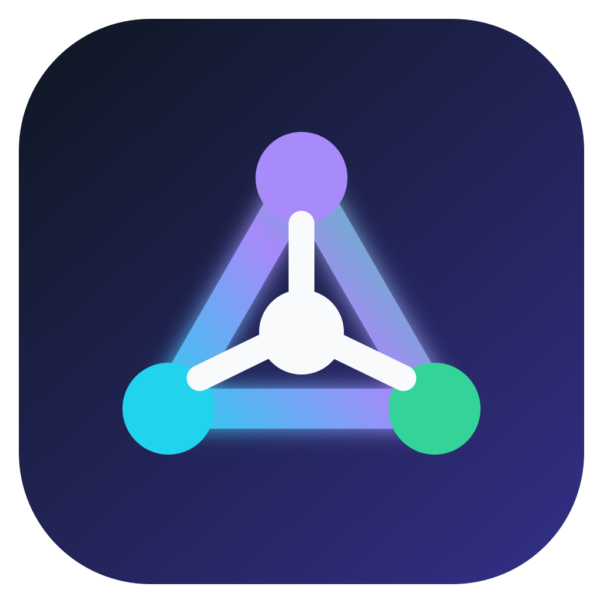

<p align="center">
  
</p>

<h1 align="center">ClaudeHub</h1>

<p align="center">
  <strong>All your Claude Code usage. One menu bar.</strong>
</p>

<p align="center">
  <a href="https://github.com/tugkanboz/claude-hub/releases/latest"></a>
  
  
  
  
  <a href="LICENSE"></a>
</p>

<p align="center">
  <a href="https://github.com/tugkanboz/claude-hub/releases/latest"><strong>Download for macOS</strong></a>
  ·
  <a href="#installation">Installation</a>
  ·
  <a href="#build">Build from source</a>
</p>

ClaudeHub is a native, lightweight macOS menu-bar app for monitoring multiple
Claude Code subscription profiles in one place. See five-hour and weekly usage,
model-specific limits, reset countdowns and extra usage without switching
accounts.


## Highlights

- **Multiple accounts** — monitor isolated Claude Code profiles from one menu.
- **Live limits** — see five-hour, seven-day and model-specific utilization.
- **Reset countdowns** — know exactly when each usage window becomes available.
- **Native and lightweight** — built with Swift and AppKit for Apple Silicon.
- **Private by design** — no telemetry, advertising or third-party analytics.
- **Automatic renewal** — refreshes normal OAuth sessions through Claude Code.
- **Localized** — Turkish, English, French and Spanish system-language support.
- **Trusted distribution** — Developer ID signed and notarized by Apple.

## Download

[**Download the latest ClaudeHub release for macOS**](https://github.com/tugkanboz/claude-hub/releases/latest)

Open the latest release and download the `.dmg` file listed under **Assets**.
Release builds are signed with a Developer ID certificate and notarized by Apple.
ClaudeHub currently supports Apple Silicon Macs running macOS 13 or newer.

## Installation

1. Download the latest `.dmg` from the [Releases page](https://github.com/tugkanboz/claude-hub/releases/latest).
2. Open the disk image and drag **ClaudeHub** into the **Applications** folder.
3. Launch ClaudeHub from **Applications**.
4. Choose **Accounts → Add Existing Claude Profile…** and select each isolated Claude Code profile directory.

## Requirements

- Apple Silicon Mac with macOS 13 or newer
- Claude Code installed
- One isolated `CLAUDE_CONFIG_DIR` per Claude account

## Prepare profiles

Log in once for every account. These commands do not change your normal
`~/.claude` profile:

```bash
CLAUDE_CONFIG_DIR="$HOME/.claude-accounts/account1" claude auth login
CLAUDE_CONFIG_DIR="$HOME/.claude-accounts/account2" claude auth login
CLAUDE_CONFIG_DIR="$HOME/.claude-accounts/account3" claude auth login
```

Open ClaudeHub, then choose **Accounts → Add Existing Claude Profile…** and select each
directory. ClaudeHub stores only the label and directory path in
`~/Library/Application Support/ClaudeHub/accounts.json`.

## Keychain access and automatic renewal

Claude Code stores credentials for isolated profiles in macOS Keychain.
ClaudeHub reads each profile once when the app starts and keeps the credential
only in memory. The five-minute usage refresh uses that in-memory value, so it
does not trigger another Keychain password prompt.

On the first launch, macOS can ask once for every Claude profile. Choose
**Always Allow** to remember the permission for published Developer ID-signed
builds.

Five minutes before a normal access token expires, ClaudeHub automatically
gives the existing refresh token and scopes back to the installed `claude`
CLI. Claude Code performs the exchange and saves its own credential. ClaudeHub
then reloads that profile. This does not open a browser, invoke a model or
consume plan usage.

## Reconnect an expired or revoked profile

Manual login is only needed if Anthropic revokes the refresh token, the user
logs out of Claude Code, or the account otherwise displays an authentication
error. Use the same profile directory that was originally added to ClaudeHub:

```bash
CLAUDE_CONFIG_DIR="$HOME/.claude-accounts/account2" claude auth login
```

Complete the browser login, quit and reopen ClaudeHub so its in-memory
credential cache is replaced, then click **Refresh Now**. The profile does not
need to be removed and added again.

## After restarting the Mac

ClaudeHub keeps the configured profile names and paths in
`~/Library/Application Support/ClaudeHub/accounts.json`, while Claude Code
keeps authentication in macOS Keychain. Restarting or shutting down the Mac
does not require another browser login.

Open ClaudeHub again after signing in to macOS. To start it automatically,
add ClaudeHub under **System Settings → General → Login Items**. Profiles that
were granted **Always Allow** Keychain access should load without another
permission prompt.

## Build

```bash
swift test
bash scripts/build-app.sh
bash scripts/package-dmg.sh
```

The application is produced at `dist/ClaudeHub.app`. Local builds receive an
ad-hoc signature. GitHub release builds are signed with a Developer ID
certificate, notarized by Apple and verified with Gatekeeper before publishing.

## Privacy

- ClaudeHub never modifies `~/.claude`.
- Tokens are never written to ClaudeHub configuration or logs; they live only in memory while the app is open.
- Requests go directly to Anthropic's OAuth usage and profile endpoints.
- There is no telemetry, advertising or third-party analytics SDK.

## License

Copyright © 2026 Tuğkan Boz. Released under the [MIT License](LICENSE).

ClaudeHub is an independent project and is not affiliated with Anthropic.
Claude and Claude Code are trademarks of Anthropic.
